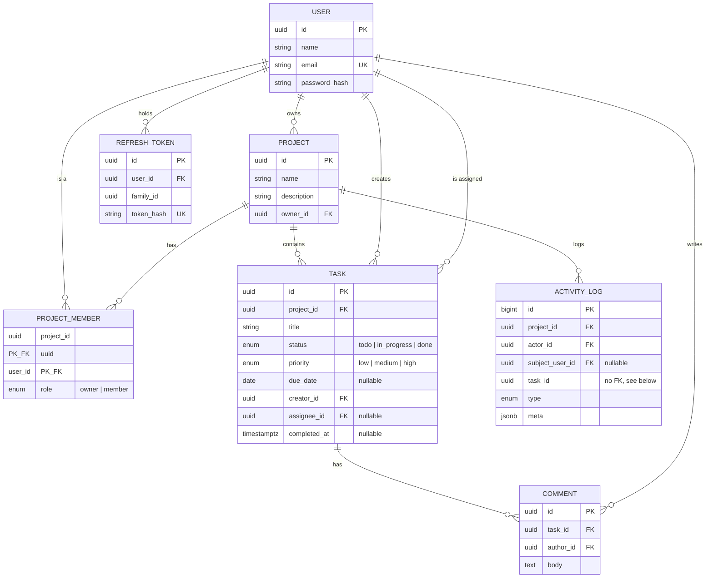

# TaskFlow

A collaborative task board — projects with owner/member roles, a live-updating task board,
comments, an activity log, and a personal dashboard. Built for the TaskFlow coding assessment.

- **Backend:** FastAPI + SQLAlchemy 2.0 + Alembic + PostgreSQL, native WebSockets
- **Frontend:** React 18 + TypeScript + Vite + TanStack Query, plain CSS
- **Stretch goals:** automated tests on critical paths (auth, roles, assignment rules, realtime
  scoping — 78 backend tests) and Docker Compose for a one-command boot

## Running it

### Docker Compose

```bash
cp .env.example .env
# set JWT_SECRET to something real:  openssl rand -hex 32
docker compose up --build
```

Frontend at `localhost:3000`, backend docs at `localhost:8000/api/docs`. On first boot the backend
migrates and, if `SEED_ON_START=true` (default), seeds three demo accounts — see below.

> I built this without a Docker daemon available, so `docker compose up` itself is unverified —
> I checked both Dockerfiles and the compose file by hand instead (env var names and `COPY` paths
> all match) and ran the equivalent stack directly (Postgres + backend + an nginx-style proxy +
> the production frontend build) through a full browser session. Please run it once before
> submitting.

### Deploying it live

See [DEPLOYMENT.md](./DEPLOYMENT.md) — one Render Blueprint (`render.yaml`) deploys the backend,
frontend, and database together, at no cost to start.

### Running it directly

```bash
# backend
cd backend
python3 -m venv .venv && source .venv/bin/activate
pip install -r requirements-dev.txt
createdb taskflow
cp ../.env.example ../.env   # edit DATABASE_URL / JWT_SECRET if needed
alembic upgrade head
python -m app.seed           # optional
uvicorn app.main:app --reload
```

```bash
# frontend — proxies /api to localhost:8000, see vite.config.ts
cd frontend && npm install && npm run dev
```

### Tests

```bash
cd backend && source .venv/bin/activate
createdb taskflow_test       # owned and truncated by the suite
pytest -q                    # 78 tests: auth, roles, task rules, filters/paging, realtime, seed, config
```

```bash
cd frontend && npm test      # unit tests for the fetch client's refresh/retry logic
```

### Demo data

`python -m app.seed` (or `SEED_ON_START=true`) creates three accounts, all with password
`Password123`: `alice@taskflow.dev`, `bob@taskflow.dev`, `carol@taskflow.dev`. Alice owns
**Website relaunch** with Bob as a member — five tasks across all three columns, one created by
Bob, one created by Alice but assigned to Bob (the cross-assignment the brief asks for), a
comment thread, and a populated activity log. Carol owns a second, unrelated project, to show
project isolation. Seeding is idempotent, so it's safe to leave on.

## Data model



Choices worth calling out:

- **`PROJECT_MEMBER`** is the many-to-many join and the single source of truth for access control —
  every permission check queries it fresh, so removing a member takes effect immediately.
- **`TASK.creator_id`** points at `users`, not the membership row, so a removed member's tasks
  survive their removal without a dangling reference.
- **`TASK`** has a composite FK `(project_id, assignee_id) → project_members(project_id, user_id)`:
  "assignee must be a member" is enforced by Postgres itself, not just application code, so it
  holds even under a race. The service layer still checks first for a clean 422.
- **`ACTIVITY_LOG.task_id`** has no FK on purpose — deleting a task shouldn't delete its own
  history, so the log keeps the task's title in `meta` and the column stays unconstrained.
- **`priority`** is a native Postgres enum declared `low, medium, high`, so `ORDER BY priority`
  sorts correctly with no `CASE` expression.
- **Refresh tokens** are stored only as a SHA-256 hash, grouped by `family_id` (one login = one
  family) — see below.

## Auth: JWT + refresh tokens

- **Access token:** 15-minute JWT, kept only in a JS variable — never `localStorage`, never a
  plain cookie, so an XSS payload can't read it. A reload starts with nothing.
- **Refresh token:** 7-day opaque value in an `httpOnly`, `SameSite=strict` cookie scoped to
  `/api/auth`, stored server-side only as a SHA-256 hash.
- **Rotation:** every refresh issues a new token and retires the old one, with a 10-second grace
  window so two tabs refreshing at the same instant don't lock each other out.
- **Theft detection:** a refresh token replayed *after* that window means it was already spent —
  the whole token family is revoked, signing out every device on that login.
- **Client-side:** `ensureToken()` refreshes proactively before expiry; `api()` also catches a
  live 401, refreshes once, and replays the request invisibly. Concurrent requests share one
  in-flight refresh (`refreshSession()` memoizes its own promise) instead of stampeding.

This is more moving parts than "JWT in `localStorage`, no refresh token," but that design has no
XSS mitigation and no server-side way to end a session — each extra piece here removes one
specific weakness.

## WebSockets

Native FastAPI/Starlette WebSockets, no Socket.IO. One socket per tab.

- **Auth:** the first message after connecting must be `{"type": "auth", "token": "<access
  token>"}` within 5 seconds, using the same access token as HTTP calls. When that token expires
  the server closes the socket (code `4401`, reason `token_expired`); the client treats that code
  as "reconnect now with a fresh token," so a live session just re-authenticates silently every
  ~15 minutes rather than going dark.
- **Scoping:** there is no client-sent `subscribe`. On connect the server looks up the user's
  memberships from `project_members` and joins the socket to exactly those rooms itself — a
  client has no way to ask for a room it isn't in. Broadcasts are built from inside the same
  transaction that made the change and only scheduled (as a `BackgroundTask`) after it commits.
- **Live membership changes:** inviting someone joins their open sockets to the new room at once;
  removing someone evicts them and sends one `removed_from_project` message — neither waits for a
  reconnect.
- **Disconnects:** the client reconnects on any close with exponential backoff + jitter (capped
  at 30s), except a `token_expired` close, which reconnects immediately. A 25s ping plus a 60s
  silence timeout catches connections that go half-open without firing `onclose`. The server
  keeps no event history to replay, so every reconnect after the first triggers a refetch instead
  of gap-filling — keeping the server stateless per connection.

## What was hard

Keeping "only the assignee or the owner can mark Done" consistent across creation *and* every
edit, without two copies of the rule drifting apart. `services/tasks.py` resolves and validates
everything before touching the `Task` object, so a rejected request changes nothing — there's a
test confirming a request that both retitles a task and tries an illegal status change leaves the
title untouched.

The refresh-token grace window was the other one: a naive "one use per token" rule passes a
simple test but breaks the moment two tabs refresh at once, since the second one looks identical
to a replayed, stolen token. The grace window — and tests that specifically race two refreshes on
the same stale token — is what makes that distinction correctly.

## Known issues / with more time

- Live updates trigger a refetch (`invalidateQueries`) rather than a pushed patch — simple and
  correct, but one extra round trip per change. A typed payload per event would avoid that.
- The dashboard's "busiest project" query is a `GROUP BY` over an owner's projects; worth an
  `EXPLAIN` at real data volumes.
- No pagination cap on a single task's comments (the activity feed does paginate, via keyset on
  `id`).
- No rate limiting on login or invites — the first thing I'd add before real users.
- No attachments on tasks or comments — text only, per the brief.

## AI usage disclosure

Built with Claude (Anthropic), working autonomously across the schema, backend, WebSocket layer,
frontend, and this README, from a project plan (stack, data model, and the decisions above) agreed
before implementation. All 78 backend tests, the frontend unit tests, and a full real-browser
two-window run of the demo script pass against a real PostgreSQL database.
